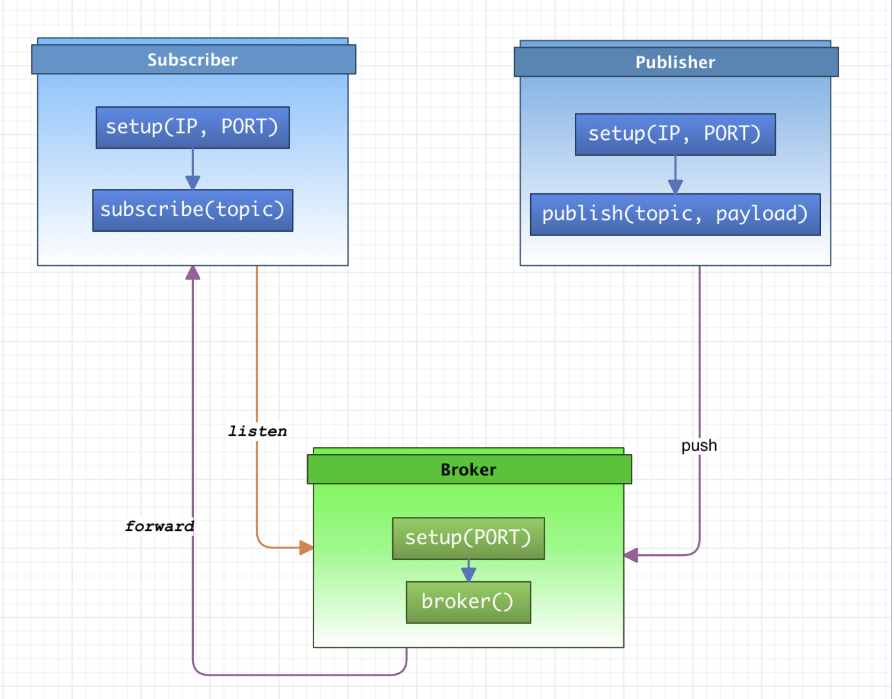

# Describing

* Run as broker

    Call `setup(PORT)` to make a socket, then call `broker()` to start a broker server proxy.

* Run as publisher

    Call `setup(IP, PORT)` to make a socket,
    then call `publish(topic, payload)` to publish `payload` over `topic` to broker.
    IP/PORT is the broker ip/port, it is a short connection.

* Run as subscriber

    Call `setup(IP, PORT)` to make a socket, then call `subscribe(topic)` to run as a subscriber;
    the `topic` is a mark for broker to identify the publisher, then we can get message from the `topic`.

    It works like below:
    

## Usage

* Test case: [test](../test)
* Example project: [Device2Device](https://github.com/tsymiar/Device2Device/tree/main/app/src/main/cpp)
