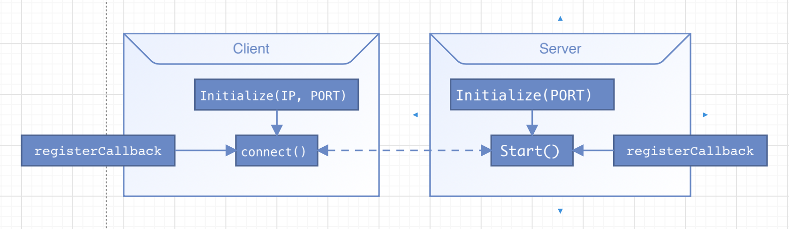

# Describing

* Run as server

    When instantiates the `Scadup` class, you can call `Initialize(PORT)` to initialize;
    then call `Start()` to start a server, you can also register callbacks to deal received data by calling
    `registerCallback()/appendCallback` with a parameter in `TASK_CALLBACK` format.

* Run as client

    Call `Initialize(IP, PORT)` to initialize, then call `Connect()` to start a client.

    

* Run as broker

    Call `Initialize(PORT)` to initialize, then call `Broker()` to start a broker server proxy.

* Run as publisher

    Call `Initialize(IP, PORT)` to initialize,
    then call `Publisher(topic, payload)` to publish `payload` over `topic` to broker.
    IP/PORT is the broker ip/port, it is a short connection.

* Run as subscriber

    Call `Initialize(IP, PORT)` to initialize, then call `Subscriber(topic)` to run as subscriber;
    the `topic` is a mark string to match the connection of publisher, so we can get message from the `topic`.

    

## Usage

* Test case: [test](../test)
* Example project: [Device2Device](https://github.com/tsymiar/Device2Device/tree/main/app/src/main/cpp)
