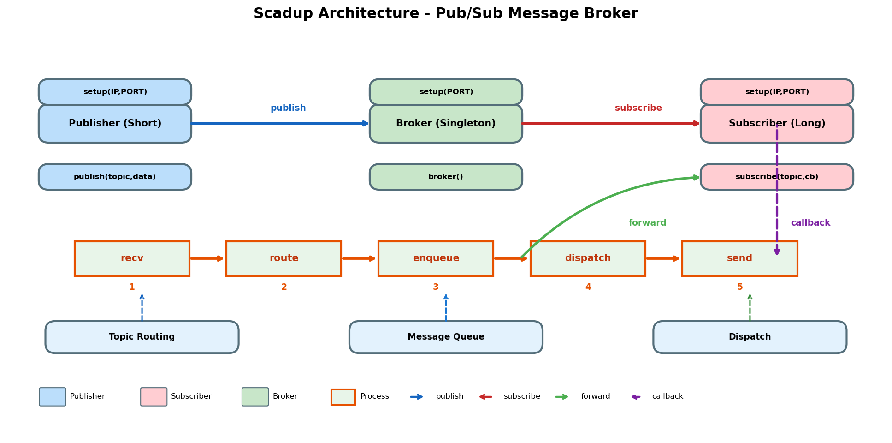

# Scadup

**S**hare **c**ommand **a**nd **d**ata under _`scadup`_ **p**roxy

A lightweight Pub/Sub message broker system.

## Quick Start

```bash
# Build
./make.sh

# Start Broker
./scadup.exe 1

# Subscribe to topic
./scadup.exe 2 1234

# Publish message
./scadup.exe 3 1234 "Hello!"
```

## Architecture

```
Publisher ──┐            ┌─── Subscriber
Publisher ──┼──▶ Broker ┼──▶ Subscriber
Publisher ──┘            └─── Subscriber
```



## Core API

```cpp
// Publisher
Publisher pub;
pub.setup("192.168.1.100", 9999);
pub.publish(0x1234, "message");

// Subscriber
Subscriber sub;
sub.setup("192.168.1.100", 9999);
sub.subscribe(0x1234, [](const Message& msg) {
    printf("%s\n", msg.payload.content);
});

// Broker
Broker::instance().setup(9999);
Broker::instance().broker();
```

## Configuration

`scadup.cfg`:
```ini
IP=192.168.18.125
PORT=9999
```

## Build

```bash
# Linux
./make.sh

# Android
cmake -DANDROID=1 -DANDROID_ABI=arm64-v8a ..
```

## Usage

* Test case: [test](../test)
* Example project: [Device2Device](https://github.com/tsymiar/Device2Device/tree/main/app/src/main/cpp)
